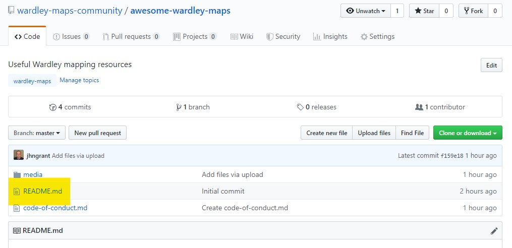
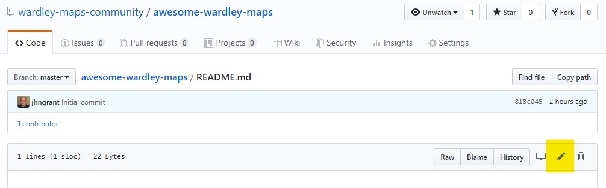

# Contribution Guidelines

Please note that this project is released with a [Contributor Code of Conduct](https://list.wardleymaps.com/code-of-conduct). By participating in this project you agree to abide by its terms.

Read the [awesome manifesto](https://github.com/sindresorhus/awesome/blob/main/awesome.md) for more information about what is considered awesome.

## Adding something to an awesome list

If you have something awesome to contribute to an awesome list, this is how you do it.

You'll need a [GitHub account](https://github.com/join)

1. Go to the [awesome-wardley-maps GitHub page](https://github.com/wardley-maps-community/awesome-wardley-maps)

2. Click on the `readme.md` file:

3. Now click on the edit pencil icon.

4. You can start editing the text of the file in the in-browser editor. You can use [GitHub Flavored Markdown](https://help.github.com/articles/github-flavored-markdown/).

5. Say why you're proposing the changes, and then click on "Propose file change".

## Other options

Prefer not to use GitHub? [Watch](https://www.youtube.com/watch?v=w79iCl0nLuY) how to contribute to the Wardley maps Awesome list by other means.

Namely, email the committers at wardleymaps@gmail.com or mention [@themapirati](https://twitter.com/themapirati) in a tweet.
